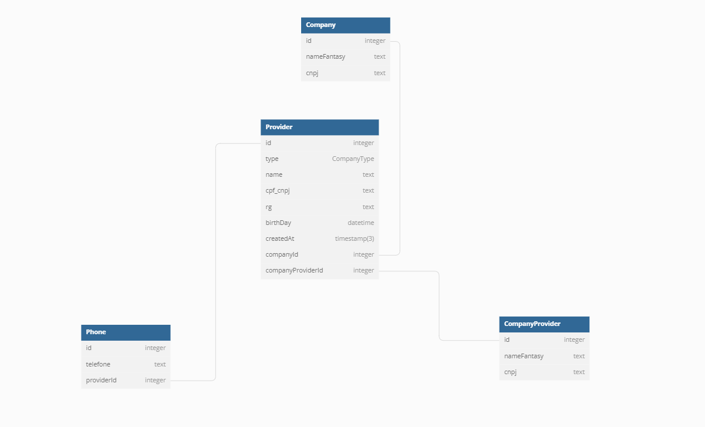

# Teste

Parei para ler o teste e observei que é na linguagem C#, vou ser sincero que não me lembro muito bem dos requisitos da vaga mas minha experiência e corriculo é voltado a Javascript, mais especificamente com NODE no backend e React para o Front.

Alexandre Abreu da Silva

##  Planejando o banco de dados.

Conforme requisito informados foi possivel chegar no seguinte relacionamento.

### Relacionamento Banco

Decidi criar um campo especifico no banco para o type 
(pessoa fisica/juridica) para caso validar as regras de negocios necessarias.

## Configurando Docker para o banco de dados.

`docker-compose up`

## Prisma

Para a comunicação API - Banco de Dados foi escolhido o ORM Prisma

### Gerando o SQL e Rodando no banco

`npx prisma migrate dev --preview-feature --skip-generate --name "init"`

### Gerando o Client do Prisma

`npx prisma generate`

### Acessando o Prisma Studio para visualizar os dados

`npx prisma studio`

### Seed para popular o banco afins de teste

`yarn seed`

### Endpoints da API

### /company

* POST - Cria uma nova empresa.

Tratamento de Errors:

* Campos obrigatorios faltando

* CNPJ já existente

* GET - Listando todas empresas.

### /providers

* POST TYPE - CNPJ - Cria uma novo fornecedor.

* CNPJ/CPF já existente

* POST TYPE - CPF - Cria uma novo fornecedor.

VALIDAÇÃO REGRA DE NEGOCIO: 

* POST - CPF - RG ou Data de Nascimento Faltando:

* POST CPF - Fornecedor Menor de idade

* Get - Listagem de fornecedores pelo ID da empresa

* Get - Listagem Com filtros

* Cadastro da Empresa a parte

